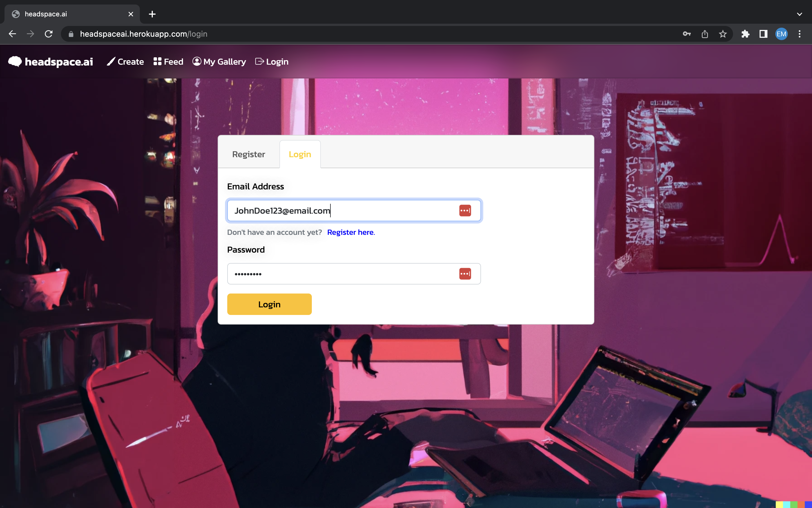
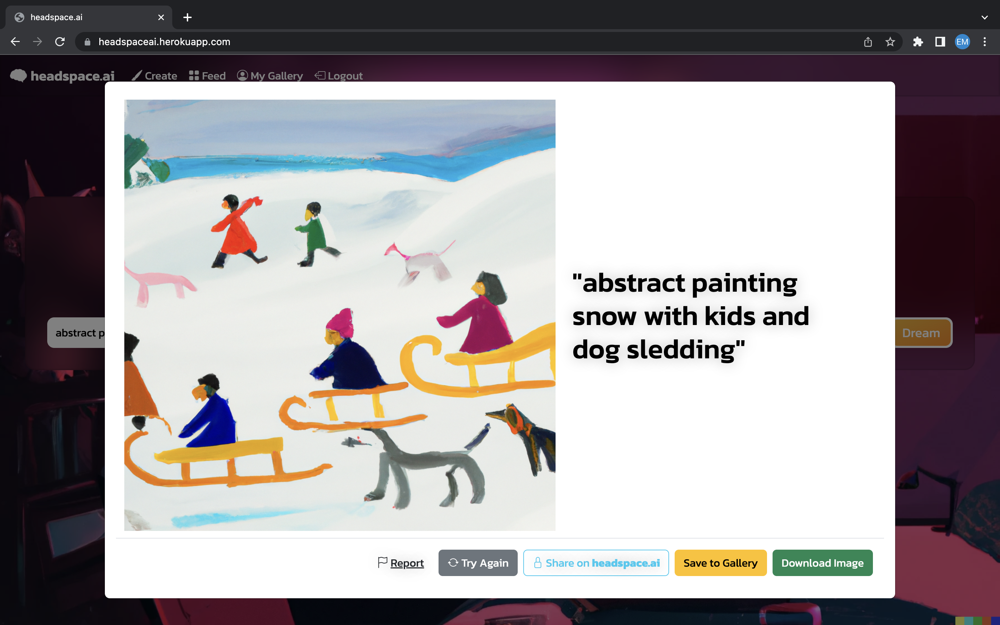

# headspace.ai  
A website for users to generate AI images and save tham to a personal gallery.
 
 
# Project Status
Submitted for evaluation.
 
 
# Project Deployed
https://headspaceai.herokuapp.com
 
https://github.com/theLemmonade/project-headspace.ai
 
 

# Screenshots of Webpage

 
 
 

# Table of Contents

  * [Technologies Used](#technologies-used)

  * [Usage](#usage)
  
  * [User Story](#user-story)

  * [Challenges](#challenges)
  
  * [Roadmap](#roadmap)
  
  * [Contributors](#contributors)

  * [Acknowledgements](#acknowledgements)
 
 

# Technologies Used
<ul>
<li>Used HTML, JavaScript, CSS, SQL, Node, Experess, and Handlebars to build the website.
<li>Used OpenAI API to capture and render DALL-E 2 generated images per user input. https://https://openai.com/api/ 
<li>Used Heroku to deploy the website.
</ul>
 
 

# Usage
Users can enter a prompt and the API will generate an AI image based on the users text input.
Users can choose to save the generated image to a personal gallery page.  Users can view recently created AI images on the "Feed" page.
 
 

# User Story
<ul>
<li>As a user I want to try an AI image generator and choose to save my created images to a personal gallery.
<li>WHEN I open the website I will be able to register or login.
<li>THEN I will be able to save AI images I create using simple text in the prompt bar.
<li>WHEN I enter my text prompt I will see the spinner and know the generator is working,
<li>THEN I will see my image pop up and can choose to "try again", "Save to Gallery" or "Download Image".
<li>WHEN I choose to save an image,
<li>THEN I can see that image in the “My Gallery” page accessed from the nav bar.
<li>WHEN I click into the “Feed” page from the nav bar,
<li>THEN I will see AI images created recently by me and other users.
<li>WHEN I click the logout button 
<li>THEN I will be redirected to the homepage.
</ul>
 
 

# Challenges
During the creation of the website the team encountered these challenges to production:
<ul>
<li>File structure and routing issues, which could have been eliminated or lessened with a wireframe.
<li>Because the API image storage was limited to one hour we needed to find another way to display a feed gallery.  With a larger-scale website with lots of users the 'live feed feature" would be easier to maintain.
<li>Handlebars was a technology that was tricky to work with.
<li>Heroku presente problems even with an application that is fully functioning locally. 
</ul>
 
 

# Roadmap
This is a responsive, interactive website using many technologies to generate an AI image based on user input, including a save feature to store a user's created images. Future developments could include:
<ul>
<li>Add options for the image created, including size and style options.
<li>Add a share button for the user to easily share an image through social media or text, or copy a link to the image which would be shareable.
<li>Add a social element in the feed page for users to comment on or react to other users' shared images.
</ul>
 
 

# Contributors
<ul>
<li>Kevin Bell
<li>Emily Bernard
<li>Alexander Frankhouser
<li>Chris Lemmon
</ul>
 
 

# Acknowledgements
Thanks to:
<ul>
<li>Instructor Kris Renaldi for his invaluable help during class sessions.
<li>Class activities, especially week 14 as a reference for handlebars issues.
<li>OpenAI for their mostly easy and mostly free to use API.
<li>Tutors and Ask BCS for their help in troubleshooting different issues.
<li>David Falvey @eyeballcramps for our icon 
</ul>
